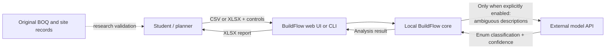
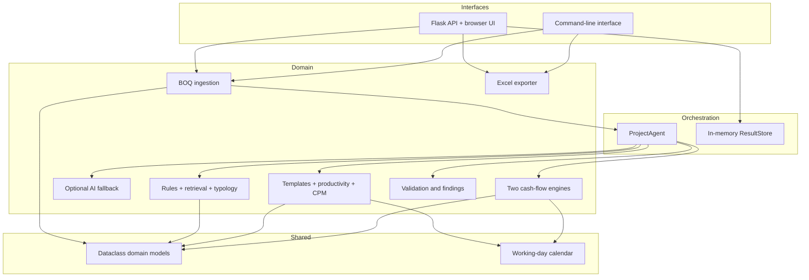

# BuildFlow system design document

| Field | Value |
|---|---|
| System | BuildFlow — BOQ planning workbench |
| Version described | `0.1.0` |
| Document status | Implemented prototype design, with planned extensions identified explicitly |
| Last updated | 23 August 2026 |
| Primary audience | BTP students, supervisor, evaluation committee, future developers and validating construction planners |
| Related documents | [Methodology](METHODOLOGY.md), [Validation protocol](VALIDATION_PROTOCOL.md), [Project README](../README.md) |

## 1. Executive summary

BuildFlow converts a priced Bill of Quantities (BOQ) into an auditable first-draft construction schedule and monthly cash-flow projection. It is designed for Indian construction BOQs and for research cases where BIM, Primavera P6 or a pre-existing activity network may not be available as input.

The central design choice is a **hybrid, bounded-agent architecture**:

- rules, local retrieval and an optional LLM interpret BOQ descriptions;
- typology-specific templates and productivity assumptions create activities and dependencies;
- deterministic Critical Path Method (CPM) code calculates dates, float and the critical path;
- deterministic arithmetic time-phases the priced BOQ into monthly cash curves; and
- a workflow agent chooses and invokes these tools while recording an audit trace.

This division prevents a generative model from silently inventing quantities, dates, dependencies or totals. The output is positioned as a planner-verifiable draft, not an approved baseline.

BuildFlow deliberately generates two cash-flow views:

1. a schedule-linked curve derived from the generated CPM; and
2. an independent phase-pattern curve derived only from the priced BOQ and contract duration.

The second path preserves the required independence between Arpit's scheduling research and Lakshay's cash-flow research. Either project can be executed and evaluated if the other does not succeed.

## 2. Background and problem definition

### 2.1 Project context

The original BTP concept was a combined BOQ → schedule → cost → cash-flow pipeline. It was split because the two students require independent objectives and deliverables:

| Workstream | Primary input | Independent method | Primary output |
|---|---|---|---|
| Arpit — scheduling | Standardised BOQ | Productivity-derived durations + typology dependencies + CPM | Baseline activity schedule and critical path |
| Lakshay — cash flow | Priced standardised BOQ + contract duration | Standard phase windows and spend-distribution curves | Monthly planned-value/cash-flow projection |
| Optional joint experiment | Outputs from both independent paths | Curve comparison | Evidence of whether detailed CPM improves the phase-pattern forecast |

The shared operation is BOQ collection and standardisation. No scheduling result is required by the independent cash-flow method.

### 2.2 Problem decomposition

The BOQ-to-plan problem contains three materially different computational tasks:

1. **Reading:** extract and interpret inconsistent BOQ text.
2. **Planning:** convert quantities into durations and build a valid construction network.
3. **Calculation:** solve the network and time-phase money without arithmetic drift.

Natural-language models are useful mainly for the first task. Classical scheduling and arithmetic methods are more appropriate for the second and third tasks. BuildFlow reflects that boundary in its component design.

### 2.3 Intended outcome

The defensible system claim is:

> BuildFlow compresses the preparation of a first-draft schedule and cash-flow view into an automated, traceable workflow that a construction planner reviews and edits.

It does not claim to replace professional judgement about work methods, temporary works, site logistics, crew negotiation, safety, weather, commercial terms or contractual approval.

### 2.4 Research case matrix

The initial cases were chosen because they stress different network structures, not because three similar examples are sufficient for generalisation:

| Case | Structural character | Design implication | Known evidence/risk to preserve |
|---|---|---|---|
| 550 KLD STP, Karnal | Deep monolithic underground RCC tank system | One-pass structural sequence with post-roof branches | Excavation reaches roughly 10.5 m in the source context; DSR lift bands are not extra volume; dewatering/shoring and hydrostatic testing require explicit review |
| Narsi Village MEP works | Linear sewer, storm, pressure and internal-drainage networks | Parallel work fronts that converge at reinstatement/testing | A single building-style chain would create false dependencies |
| Narsi Village RWH | Two small RCC tanks plus specialist recharge borewell | Offset tank crews and an independent drilling track | Source scope/quantity mismatch requires an explicit two-tank assumption; the known 25-Apr-2026 to 07-Aug-2026 comparison period crosses the monsoon |

The bundled CSVs reproduce the structural characteristics for software demonstration but are not verbatim copies of the source tenders and must not be used as ground truth.

## 3. Goals, non-goals and success criteria

### 3.1 Goals

- Accept common Indian BOQ spreadsheets without requiring a fixed row number for headers.
- Preserve the relationship between every source row and its generated work/cost allocation.
- Classify BOQ text with reviewable evidence and confidence.
- Change schedule topology when the project typology changes.
- Guarantee a structurally valid CPM network or fail clearly.
- Reconcile priced BOQ value to scheduled activity value.
- Keep the independent cash curve isolated from CPM dates and dependencies.
- Flag uncertainty, unpriced work, missing scope and project-specific risks.
- Allow a planner to revise durations and immediately recalculate dependent results.
- Export a self-contained workbook containing data, schedule, curves, assumptions, findings and the agent trace.
- Support research ablations and ground-truth validation.

### 3.2 Non-goals for version 0.1

- Producing a contractually approved or resource-levelled baseline.
- Replacing Primavera P6, Microsoft Project, Candy, CostX or a contractor ERP.
- Reading PDFs, drawings, BIM models or unstructured tender archives directly.
- Estimating missing tender rates as if they were verified values.
- Modelling detailed tax, advance, escalation, financing or final-account rules.
- Optimising crews or equipment across several concurrent projects.
- Learning productivity rates automatically from the demonstration data.
- Claiming statistical generalisation from three typologies.
- Operating as a multi-user production SaaS.

### 3.3 Prototype acceptance criteria

An analysis is structurally usable only when:

- all activity predecessor identifiers exist;
- the dependency graph is acyclic;
- priced BOQ value and activity value reconcile within the configured tolerance;
- unclassified, unpriced and low-confidence rows are visible;
- cash-flow cumulative value reaches the priced BOQ total;
- assumptions and planner overrides appear in the audit output; and
- built-in demonstration rows are not represented as validation evidence.

Accuracy against real projects is a separate research acceptance step described in the [validation protocol](VALIDATION_PROTOCOL.md).

## 4. Stakeholders and primary use cases

| Stakeholder | Need | Supported workflow |
|---|---|---|
| BTP student | Reproducible experiments | Run classifier modes, typology cases and cash-curve comparisons |
| Construction planner | Fast first draft | Upload BOQ, inspect classifications, edit durations and export |
| Supervisor/evaluator | Auditability | Inspect evidence, assumptions, findings, CPM structure and agent trace |
| Future developer | Safe extension points | Add taxonomy rows, typology templates, productivity sources or persistence |
| Data provider | Confidentiality control | Use offline modes; explicitly opt in before descriptions are sent externally |

Primary use cases are:

1. analyse a built-in sanitised demonstration;
2. upload a priced CSV/XLSX BOQ;
3. compare keyword, retrieval and hybrid BOQ readers;
4. auto-detect or explicitly select project typology;
5. generate and inspect a CPM schedule;
6. compare schedule-linked and independent cash curves;
7. replan after changing activity durations; and
8. export a review workbook.

## 5. Architectural principles

### 5.1 Deterministic engineering core

Dates, float, dependency validation and money are never accepted from free-form model output. The same classified BOQ and configuration must produce the same engineering result.

### 5.2 Generative AI is advisory and bounded

The optional AI reader operates only on rows below a classification-confidence threshold. It must return a work-package enum through a strict JSON schema. It cannot set quantities, rates, durations, allocation shares or predecessors.

### 5.3 Typology before sequencing

A deep monolithic tank, linear utility network and small parallel RWH system do not share one universal activity topology. BuildFlow first selects a typology, then applies the corresponding network template.

### 5.4 Preserve uncertainty instead of hiding it

Unknown rows become visible miscellaneous work. Missing rates remain zero and are flagged. Missing testing or temporary-work scope becomes a finding. The system avoids silently “completing” source evidence.

### 5.5 Cash-flow independence by construction

The independent cash-flow function accepts BOQ items, project configuration and only a fallback duration when no contract duration is supplied. With a contract duration present, CPM activity dates and planner schedule edits do not change this curve.

### 5.6 Modular monolith for the BTP stage

The prototype is a single Python application with explicit module boundaries. This reduces deployment and debugging cost while keeping the calculation engines reusable from the web interface, CLI and tests.

## 6. System context and trust boundaries



Trust boundaries:

- Files and calculations remain local in offline modes.
- Enabling the AI fallback crosses an external network/data-processing boundary.
- Built-in CSVs are sanitised demonstrations and sit outside the research ground-truth boundary.
- The browser client is not trusted to enforce numeric limits; `ProjectConfig` validates them again on the server.

## 7. Component architecture



### 7.1 Module responsibilities

| Module | Responsibility | Must not do |
|---|---|---|
| `ingestion.py` | Detect headers, parse CSV/Excel, normalise numbers, preserve source location | Classify or invent missing rates |
| `taxonomy.py` | Work-package classification, physical-track inference, typology scoring | Create dates or dependencies |
| `llm.py` | Review low-confidence descriptions under a strict enum schema | Generate schedules or overwrite verified quantities |
| `scheduling.py` | Typology templates, allocations, duration calculation, DAG validation, CPM and replanning | Call external AI or mutate source BOQ values |
| `calendar.py` | Convert working-day offsets to calendar dates | Model project holidays in v0.1 |
| `cashflow.py` | Produce schedule-linked and independent monthly curves and compare them | Estimate missing BOQ prices |
| `validation.py` | Check invariants and domain risks | Silently repair source data |
| `agent.py` | Orchestrate the workflow and record decisions | Perform free-form engineering calculation |
| `exporter.py` | Create the review workbook | Recalculate or reinterpret results |
| `web.py` | HTTP endpoints, upload limit, sample selection and short-lived job storage | Contain domain algorithms |
| `benchmark.py` | Evaluate offline reader ablations | Serve as final research validation by itself |

## 8. End-to-end processing flow

### 8.1 Initial analysis

1. The interface creates a `ProjectConfig` and supplies either an uploaded file or built-in sample identifier.
2. The ingestion layer scans the first 40 rows of each worksheet for a description and quantity header.
3. Valid rows become `BOQItem` objects. Amount is calculated only when both verified quantity and rate exist.
4. The agent scores the project typology unless the planner selected one explicitly.
5. The offline classifier assigns work package, phase, track, evidence and confidence.
6. If explicitly enabled, the AI reader reviews only rows with confidence below `0.68`.
7. The scheduler selects a typology template and allocates each classified BOQ row to one or more activities.
8. Productivity assumptions and allocation shares produce activity durations and costs.
9. Unallocated row fractions become a conservative miscellaneous activity; they are not dropped.
10. The scheduler verifies the graph and calculates CPM dates, float and critical activities.
11. The cash-flow engine creates both the schedule-linked and independent curves.
12. Validation checks cost reconciliation, uncertainty, missing scope and duration variance.
13. The agent packages metrics, assumptions, findings and trace events into `AnalysisResult`.
14. The web result store retains the latest 20 jobs in memory for replanning and export.

### 8.2 Planner replanning

1. The client submits activity IDs with replacement durations and, through the API, may also submit predecessor changes.
2. Overrides are applied to a deep copy of the stored result.
3. Negative durations, unknown activity IDs, missing predecessors and cycles are rejected.
4. CPM and the schedule-linked cash curve are recalculated.
5. With an entered contract duration, the independent phase curve remains unchanged.
6. Validation is rerun and a `planner_replan` trace event is appended.

## 9. Domain data model

### 9.1 Core entities

| Entity | Important fields | Design purpose |
|---|---|---|
| `BOQItem` | source row/sheet, description, unit, quantity, rate, amount, package, phase, track, confidence, evidence, flags | Keeps source provenance beside interpretation |
| `ProjectConfig` | typology, start, contract duration, structure count, workweek, classifier/cash modes, percentages, crew multiplier, provenance | One validated control object for every engine |
| `Activity` | predecessors, duration, cost, source item IDs, CPM offsets/dates, float, critical flag, assumption | Makes schedule logic and cost mapping inspectable |
| `CashFlowPeriod` | gross value, overhead, expenditure, receipt, retention, net flow and cumulative values | Separates planned value from commercial cash fields |
| `Finding` | severity, stable code, message, recommendation | Machine-readable and human-readable audit output |
| `TraceEvent` | ordered step, tool, status, summary, structured details | Records agent decisions without exposing hidden model reasoning |
| `AnalysisResult` | config, typology, items, activities, both curves, findings, trace, metrics, assumptions, job ID | Immutable-style handoff between engines and interfaces |

### 9.2 Key relationships

- One BOQ item may fund several activities through allocation shares.
- One activity may aggregate several BOQ items or packages.
- `Activity.boq_item_ids` preserves the reverse mapping needed for audit.
- Activity predecessor IDs form a directed graph.
- Both cash curves refer to the same priced BOQ total but use different time bases.
- Findings and assumptions belong to the complete analysis, not individual UI views.

### 9.3 Data lifecycle

Version 0.1 holds uploaded content and analysis results only in process memory. The result store is an ordered, lock-protected cache of at most 20 `AnalysisResult` objects. Restarting the application removes all jobs. An exported workbook is therefore the durable result artifact.

No database schema, user account, long-term file storage or audit-log retention is implemented.

## 10. BOQ ingestion design

### 10.1 Supported formats

- CSV, with delimiter detection for comma, semicolon or tab and comma fallback.
- XLSX and XLSM, read with formulas resolved to cached values when available.
- Maximum web upload size: 20 MB.

Legacy binary `.xls`, PDF and image-based BOQs are not supported.

### 10.2 Header detection

The parser searches the first 40 rows for recognised aliases. A usable header requires both description and quantity. Optional fields are unit, rate and amount.

A deliberate safety decision excludes a bare `Item` header from description aliases because Indian BOQs commonly use it for serial numbers. This prevents every description from becoming `1`, `2`, `3`, and so on.

### 10.3 Numeric and monetary rules

- Currency marks and comma separators are removed during numeric parsing.
- A row without description or with zero quantity is skipped.
- If amount is missing and quantity and rate are present, `amount = quantity × rate`.
- If rate is missing but amount exists, the rate is derived and flagged.
- If rate and amount are both missing, amount stays zero and the row is flagged as unpriced.
- No market rate is inserted automatically.

### 10.4 Known ingestion limitations

- Only the first usable worksheet is read.
- Merged-cell section hierarchies are not retained.
- Complex formulas without cached Excel results may appear blank.
- Rows representing headings with non-zero quantities may require manual cleanup.
- Unit conversion is limited to recognised scheduling units.

## 11. Classification and typology design

### 11.1 Taxonomy

The implemented taxonomy includes preliminaries, earthwork, dewatering/shoring, PCC, RCC, reinforcement, formwork, masonry, waterproofing, sewer/storm/pressure pipes, internal drainage, manholes, borewells, plumbing, electrical work, mechanical equipment, finishes, backfill, road reinstatement, testing and unknown work.

Each taxon contains:

- a stable package key;
- a broad construction phase;
- keyword phrases; and
- one or more retrieval examples.

### 11.2 Offline reader modes

For a description `d` and taxon `t`:

- phrase matching supplies a rule score;
- longer matching phrases receive a small additional weight;
- primary construction actions such as excavation, backfill, formwork and drilling receive an additional action weight;
- retrieval uses cosine similarity between token-count vectors for `d` and each example.

The selectable modes are:

| Mode | Score used | Research purpose |
|---|---|---|
| `rules` | Phrase/action score | Cheap deterministic baseline |
| `retrieval` | `2.5 × similarity` | Local retrieval ablation |
| `hybrid` | Rule score + `1.25 × similarity` | Default offline reader |

Confidence is a bounded heuristic based on the best score and its margin over the runner-up. It is an operational review signal, not yet a statistically calibrated probability.

### 11.3 Action-over-context rule

Construction descriptions contain both an operation and a location/network. For example, “backfilling sewer trench” contains the word *sewer* but schedules as backfill. Action phrases therefore receive more weight than contextual network terms. Physical track is inferred separately as sewer, storm, pressure, internal, borewell, tank or general.

### 11.4 DSR extra-lift guardrail

An excavation “extra lift” row prices work at greater depth but does not represent an additional excavation volume. It is classified as earthwork and contributes cost, while its quantity is excluded from productivity workload. This prevents duplicate duration.

### 11.5 Typology inference

Project name and BOQ descriptions are scored against weighted hints for:

- `stp_tank`;
- `linear_mep`;
- `rwh`; and
- `building`.

The highest score determines the inferred typology and a heuristic confidence. A planner-selected typology overrides inference and is recorded with full decision confidence; it does not imply that the selection is factually correct.

### 11.6 Optional AI fallback

The fallback calls Groq's free-tier, OpenAI-compatible Chat Completions endpoint (`GROQ_API_KEY`; model `openai/gpt-oss-120b` by default, overridable with `BUILDFLOW_LLM_MODEL` or `llm_model`). When `use_llm_fallback` is true:

- only items below `0.68` offline confidence are sent, at most 20 per request;
- the request includes IDs, descriptions and units, not rates or project files;
- the response must match a strict JSON schema (`strict: true`, constrained decoding);
- the package must be one of the configured enum values, and this is re-checked in code;
- the model is instructed not to estimate quantities, rates, dates or dependencies;
- an HTTP 429 is retried after the `Retry-After` interval, up to three attempts per request; and
- a returned classification is accepted only for a known row ID, a known package and a model-reported confidence between `0.55` and `1`.

If the key, network, rate limit or response is unavailable or unreadable, the agent retains the offline result, records a skipped trace step and raises a finding instead of failing the entire analysis. The trace records the provider and model used. A local provider (for example Gemma 4 through Ollama's OpenAI-compatible endpoint) can be added as another `Provider` constant without changing the request path.

## 12. Schedule generation design

### 12.1 Stage specification

Each typology is a list of immutable `StageSpec` records containing:

- activity ID and name;
- package-to-activity allocation shares;
- predecessor IDs;
- logical track and accepted source tracks;
- minimum duration;
- explicit waiting/curing allowance; and
- a human-readable assumption.

Templates express construction topology. They do not contain source BOQ prices.

### 12.2 Cost and quantity allocation

For every activity, matching items contribute:

```text
allocated cost     = item amount × allocation share
allocated quantity = item quantity × allocation share
```

Shares for a repeated package sum to one across relevant stages. For example, STP RCC/reinforcement/formwork is split across raft, walls and roof. RWH tank work is split equally across the configured structure count.

Any item fraction below `99.9%` allocation becomes `OTH — Unmapped / miscellaneous BOQ work`. The conservative activity depends on current terminal activities and forces planner review while preserving total value.

### 12.3 Productivity duration model

The current model calculates:

```text
row workload days = allocated quantity / package-and-unit daily productivity
productive days   = ceil(sum(row workload days) / crew multiplier)
activity duration = max(template minimum, productive days) + wait allowance
```

Recognised units include cubic metres, square metres, square feet, running metres, kilograms, tonnes, numbers, days and points.

The rates in `PRODUCTIVITY` are prototype defaults. They are not represented as published CPWD norms. Final BTP analysis must attach source, location, crew composition, observation period and calibration status to each rate.

### 12.4 Typology networks

#### STP / deep monolithic tank

Core path:

```text
Mobilisation → deep excavation → PCC → RCC raft → RCC walls → RCC roof
```

After the roof, waterproofing/backfill, equipment installation and plant-room finishes branch. Hydrostatic testing is retained as a zero-cost engineering hold point when absent from the civil BOQ. The template raises separate audit risks for missing dewatering/shoring and leak testing.

#### Linear MEP works

Sewer, storm-water and pressure-pipe tracks start after mobilisation and proceed independently through trench, laying/chamber and backfill work. Internal drainage is another parallel branch. External tracks converge at road reinstatement, then join internal work at integrated testing.

This avoids the invalid single-structure sequence a generic building template would impose.

#### Rainwater harvesting

Each tank contains excavation, PCC, RCC, waterproofing and finishes/backfill. The next tank's excavation follows the preceding tank's PCC to model reuse of the early-work crew without making complete tanks sequential. Borewell drilling depends only on mobilisation and represents a separate rig crew. All tank and borewell tracks converge at system testing.

#### RCC building

The building template covers mobilisation, foundations, aggregate RCC substructure/superstructure, masonry, MEP first fix, waterproofing, finishes, final fix, external work and handover. The aggregate superstructure stage must be expanded into floor/zone cycles before rigorous building validation.

### 12.5 CPM algorithm

The graph uses finish-to-start, zero-lag links in version 0.1.

1. Kahn's algorithm checks predecessor existence and calculates a topological order.
2. A forward pass sets:

   ```text
   ES(activity) = max(EF(predecessors)), default 0
   EF(activity) = ES(activity) + duration
   ```

3. A reverse pass from project finish sets latest finish/start.
4. Total float is `LS − ES`.
5. Activities with zero total float are critical.

Time complexity is `O(V + E)` after activities are constructed, where `V` is activity count and `E` is dependency count.

### 12.6 Calendar conversion

Internal CPM values are integer working-day offsets. The calendar module converts them to dates under a 5-, 6- or 7-day workweek. Under the default six-day calendar, Sunday is excluded.

The current calendar does not include national/site holidays, weather calendars, night shifts or trade-specific calendars.

## 13. Cash-flow design

### 13.1 Shared output semantics

Both engines output monthly:

- gross planned work value;
- site overhead;
- planned expenditure;
- certified receipt after retention and payment lag;
- retention withheld;
- net period cash flow;
- cumulative work value; and
- cumulative percentage.

The BOQ contains priced work value, not necessarily the contractor's true direct cost. Therefore “gross work value” and its cumulative S-curve are the most defensible prototype outputs. Commercial cash fields remain scenario variables.

### 13.2 Schedule-linked curve

For each cost-bearing activity:

1. enumerate its working dates;
2. divide activity cost uniformly across those dates; and
3. aggregate daily value into calendar months.

This curve is sensitive to generated activity durations, links and planner replanning.

### 13.3 Independent phase-pattern curve

Each package maps to a start and finish fraction of project duration, for example early substructure windows and later finishes/testing windows. Within that window, a smoothstep cumulative function is used:

```text
smoothstep(x) = 3x² − 2x³, for x clamped to [0, 1]
```

Monthly item value is the difference between cumulative values at consecutive month ends. Weights are normalised to preserve the item's exact priced amount.

The time base is:

```text
entered contract duration
    OR, only if absent,
norms-based CPM duration as a fallback
```

For independent research, contract duration must be entered. That guarantees the curve does not consume Arpit's schedule.

### 13.4 Overhead, retention and payment lag

- Total site overhead is `BOQ value × overhead percentage` and is spread evenly across active work months.
- Retention is calculated against gross work value in the originating month.
- The net certified amount is shifted by the configured number of months.
- Net cash flow is certified receipt minus planned expenditure.

These are simplified scenario mechanics, not jurisdiction- or contract-specific payment certification rules.

### 13.5 Curve comparison

The prototype reports:

- mean absolute monthly value difference;
- that MAE as a percentage of total schedule-linked value; and
- peak month for each curve.

Final research should add cumulative checkpoint error, peak displacement, MAPE with zero-month handling and normalized area between curves.

## 14. Agent orchestration design

### 14.1 Agent definition

`ProjectAgent` is a bounded workflow controller, not an unconstrained conversational agent. Its autonomy is limited to selecting and sequencing known tools. All calculation logic remains inside testable domain functions.

### 14.2 Initial workflow state machine

| Step | Tool label | Input | Output/failure policy |
|---:|---|---|---|
| 1 | `inspect_boq` | Parsed rows | Row/unpriced counts |
| 2 | `select_typology` | Name and descriptions | Inferred or planner-selected typology |
| 3 | `classify_boq` | BOQ items and mode | Packages, tracks, evidence, confidence |
| 4 | `llm_reader` | Low-confidence subset | Optional improvements; failure degrades safely |
| 5 | `build_cpm` | Classified items and config | Valid activity network and CPM result |
| 6 | `time_phase_cost` | Activities, items and config | Two curves and comparison |
| 7 | `audit_result` | Complete analysis | Findings and acceptance signals |

Every step emits `TraceEvent`. The trace records actions, counts and decisions, not hidden chain-of-thought.

### 14.3 Why the agent does not generate schedules directly

Allowing a model to return an entire Gantt would create four problems:

- no structural guarantee that the network is acyclic;
- unstable results across repeated calls;
- arithmetic and reconciliation errors;
- weak attribution from source rows to generated activities.

Tool orchestration retains the interactive “agent” framing while keeping engineering behavior reproducible.

## 15. Validation and guardrails

### 15.1 Structural checks

- Missing predecessor references cause schedule generation to fail.
- Cycles cause schedule generation/replanning to fail.
- Negative duration overrides are rejected.
- Unknown override activity IDs are rejected.
- The completion milestone depends on all terminal work tracks.

### 15.2 Monetary checks

- BOQ and activity totals are compared after allocation.
- Tolerance is the larger of ₹1 or `0.1%` of BOQ value.
- Unpriced rows remain visible and make the cash-flow total explicitly incomplete.
- Independent-curve item weights are normalised to preserve total value.

### 15.3 Uncertainty checks

- Unknown work packages.
- Classification confidence below `0.68`.
- Unmapped activity allocation.
- Unavailable AI fallback.
- Norms-based versus contract-duration variance greater than ten percent or five working days.

### 15.4 Typology checks

- STP: absent dewatering/shoring.
- STP: absent hydrostatic/leak-testing item.
- RWH: explicit confirmation when quantities are spread across multiple tanks.
- STP/RWH: monsoon exposure when the configured start month is June–September.

Findings are advisory except graph and configuration errors, which prevent invalid calculation.

## 16. Interface and API design

### 16.1 Browser interface

The single-page workbench provides:

- evidence selection/upload;
- project and research controls;
- headline reconciliation/duration/classification metrics;
- critical-path and finding overview;
- editable Gantt;
- cumulative cash-flow comparison and monthly ledger;
- classified BOQ inspection and filtering;
- assumptions and agent trace; and
- Excel export.

The browser performs presentation and request composition only. Python remains the source of truth for calculations.

### 16.2 HTTP endpoints

| Method and path | Purpose | Important behavior |
|---|---|---|
| `GET /` | Serve workbench | Static client plus Flask template |
| `GET /api/health` | Liveness check | Returns service and version |
| `GET /api/samples` | List built-in demonstrations | Does not expose backing filenames |
| `POST /api/analyze` | Run analysis | Multipart form with sample ID or uploaded BOQ |
| `POST /api/jobs/{job_id}/replan` | Apply activity overrides | JSON body with `overrides` array |
| `GET /api/jobs/{job_id}/export.xlsx` | Download workbook | Requires job still present in memory |

Example replan request:

```json
{
  "overrides": [
    {"id": "EXC", "duration_days": 30},
    {"id": "WPR", "duration_days": 12}
  ]
}
```

The API returns `400` for invalid input or schedule overrides, `404` for an expired/unknown job, `413` for uploads over 20 MB and `500` for unexpected internal failures.

### 16.3 CLI

The CLI invokes the same ingestion, agent and export modules. It supports file path, name, typology, start date, contract duration, structure count, classifier mode, opt-in LLM and output path. This gives experiments a scriptable path independent of the browser.

### 16.4 Excel output contract

The workbook includes:

1. Executive Summary
2. Priced BOQ
3. CPM Schedule
4. Primary Cash Flow
5. Independent Phase Curve, when comparison mode is active
6. Assumptions & Checks
7. Agent Trace

The workbook is an analysis handoff, not a native P6/MS Project exchange file.

## 17. Configuration

| Configuration | Default | Effect |
|---|---:|---|
| `typology` | `auto` | Select/infer topology |
| `workweek_days` | `6` | Calendar conversion |
| `classifier_mode` | `hybrid` | Offline reader ablation |
| `use_llm_fallback` | `false` | External low-confidence review |
| `BUILDFLOW_LLM_MODEL` | `openai/gpt-oss-120b` | Groq model identifier for the optional reader |
| `GROQ_API_KEY` | unset | Required only for AI fallback |
| `cashflow_mode` | `compare` | Primary/secondary curve selection |
| `indirect_cost_pct` | `0` | Scenario overhead |
| `retention_pct` | `0` | Scenario retention |
| `payment_lag_months` | `1` | Receipt timing |
| `crew_multiplier` | `1.0` | Scales productive days globally |

`ProjectConfig` enforces allowed modes, positive durations/counts, a 1–7 day workweek, positive crew factor, non-negative payment lag and 0–100 percentage ranges.

## 18. Security, privacy and data governance

### 18.1 Current protections

- External AI is opt-in and off by default.
- Only ambiguous descriptions and units are included in the AI payload.
- AI output is schema constrained and enum limited.
- API keys are read from environment variables and are not returned in results or exports.
- Groq does not retain inference data by default; Zero Data Retention can additionally be enabled in Groq's Data Controls.
- File uploads are capped at 20 MB.
- Export filenames are sanitised.
- Uploaded files are parsed in memory and not intentionally persisted.
- HTML rendering uses text-safe client operations or escaping for source descriptions.

### 18.2 Threats and gaps before production use

- There is no authentication, authorization, CSRF protection or tenant isolation.
- Flask's development server is not a production deployment target.
- XLSX decompression/resource-exhaustion controls beyond the upload limit are not implemented.
- The in-memory job ID is not an access-control mechanism.
- Application logs and upstream infrastructure must be reviewed for accidental sensitive-data capture.
- Data-processing approval is required before enabling any external AI provider for confidential tenders.
- Dependency scanning, rate limiting, TLS termination and secrets management are not included.

The prototype should run on localhost or a controlled research machine unless these gaps are addressed.

## 19. Reliability, performance and scalability

### 19.1 Expected scale

The current target is a single BOQ containing tens to a few thousand rows and a generated network containing tens to low hundreds of activities.

Approximate algorithmic costs are:

- parsing: `O(N × C)` for `N` rows and scanned columns;
- classification: `O(N × T × E)` for taxa/examples;
- activity allocation: `O(N × S)` for template stages;
- CPM: `O(V + E)` for activity graph vertices/edges;
- cash phasing: proportional to activity working days or item-month combinations.

These are suitable for interactive BTP cases. They are not designed for portfolio-scale scheduling.

### 19.2 Current reliability behavior

- Domain errors return explicit messages rather than partial schedules.
- Optional AI failure degrades to offline classification.
- The result cache is lock protected for threaded Flask requests.
- Results are lost on restart and may be evicted after 20 newer jobs.
- No background queue, retry worker or distributed lock is required at prototype scale.

### 19.3 Production evolution

If multi-user or long-running operation becomes necessary:

- move jobs and provenance to PostgreSQL/object storage;
- execute analysis in a background worker;
- version taxonomy, productivity libraries and templates;
- store immutable input hashes and output manifests;
- add authentication and project-level authorization; and
- export schedule formats such as CSV/XER only after validating their semantics.

## 20. Observability and auditability

### 20.1 Current signals

- ordered agent trace with structured details;
- stable finding codes and severities;
- classification confidence/evidence per BOQ row;
- source sheet and row per BOQ item;
- BOQ item IDs per activity;
- explicit assumptions per activity and analysis;
- reconciliation delta;
- duration and curve-comparison metrics; and
- planner override trace events.

### 20.2 Planned research provenance

For defensible experiments, every run should additionally record:

- input file hash and source metadata;
- application commit/version;
- taxonomy/template/productivity-library versions;
- classifier mode, thresholds and optional model identifier;
- timestamp and operator;
- raw versus planner-corrected result; and
- ground-truth dataset version.

This metadata is planned but not persisted automatically in version 0.1.

## 21. Testing strategy

### 21.1 Implemented automated tests

The current suite covers:

- avoiding the serial-number/header parsing failure;
- Excel header detection and amount derivation;
- end-to-end STP, MEP and RWH analysis;
- classification coverage;
- cost reconciliation;
- valid topological ordering and critical path presence;
- completion of both cash curves at 100%;
- DSR extra-lift quantity exclusion;
- parallel MEP tracks;
- independent RWH borewell track and shared-crew tank offset;
- independent cash-flow stability after CPM replanning;
- cycle rejection;
- workbook sheet generation;
- offline classifier benchmark execution; and
- web health, analysis and export endpoints.

### 21.2 Manual browser checks performed

- sample selection and analysis;
- headline metrics and findings;
- Gantt rendering;
- duration edit and CPM recalculation;
- cash-flow chart behavior;
- RWH and STP views;
- Excel download route; and
- browser console errors.

### 21.3 Missing tests

- live external-AI integration under a controlled test account;
- malformed and adversarial Excel corpus;
- very large BOQs and resource limits;
- browser upload of diverse real BOQ layouts;
- accessibility regression tests;
- concurrency and result-cache eviction;
- golden-file validation of exported workbook values;
- property-based CPM and allocation invariants; and
- accuracy tests against real site schedules/cash records.

## 22. Research evaluation design

### 22.1 Reader experiment

Compare rules, retrieval, hybrid and optional hybrid+AI on a frozen expert-labelled corpus. Report accuracy, macro-F1, abstention rate, per-package confusion, calibration and review time.

The included 20-row benchmark is a smoke test for the harness, not research evidence.

### 22.2 Schedule experiment

For every typology, compare the generated network with an approved/actual schedule after an expert activity mapping. Measure activity coverage, precedence precision/recall, duration error, project-finish error, critical-activity overlap and corrections required.

### 22.3 Cash-flow experiment

Evaluate the independent phase curve against verified monthly values first. Then compare the schedule-linked curve to determine whether CPM detail produces a material improvement. Separate results by typology instead of pooling three structurally different cases.

### 22.4 Leakage control

- Freeze held-out projects before changing keywords, examples or templates.
- Do not include actual schedule dates in classifier prompts.
- Do not calibrate and evaluate productivity on the same project without disclosure.
- Keep demonstration rows out of accuracy totals.
- Report raw and planner-corrected performance separately.

## 23. Design decisions and alternatives

| Decision | Selected approach | Alternatives considered | Reason and trade-off |
|---|---|---|---|
| Overall architecture | Hybrid deterministic core | Raw prompted LLM; pure OR | Better auditability than LLM; more flexible reading than rules alone |
| Agent | Bounded tool orchestrator | Autonomous schedule-generating agent | Preserves interactive workflow without surrendering CPM correctness |
| Text interpretation | Rules + local retrieval + optional fallback | Fine-tuned small model | Works with small data; fine-tuning is not justified yet |
| Sequencing | Typology templates | Universal sequence; model-generated links | Encodes structural differences and is testable; requires template maintenance |
| Schedule calculation | Classical CPM | LLM dates; simulation-only approach | Deterministic and understood by construction evaluators |
| Cash-flow independence | Contract-duration phase windows | Consume CPM dates | Meets independent-project requirement; less site-specific |
| Application shape | Python modular monolith | Microservices | Lower BTP operational cost; later scaling needs decomposition/persistence |
| Persistence | In-memory, 20 jobs | Database | Sufficient for local prototype; jobs are ephemeral |
| Output | Browser + Excel + CLI | P6/BIM integration first | Easy evaluation and adoption; limited interoperability |
| Missing values | Flag/retain zero | Market-rate imputation | Protects validity; produces incomplete monetary totals until corrected |

## 24. Known limitations and technical debt

### High priority before dissertation claims

- Replace starter productivity values with cited/calibrated norms and attach provenance.
- Use original BOQs and verified schedules/cash records.
- Expand the labelled reader corpus and freeze test projects.
- Add expert mappings between BOQ rows, generated activities and ground-truth activities.
- Define whether contract duration is expressed in working or calendar days for each source and convert explicitly.
- Verify commercial cash-flow semantics with the project contract/accounting perspective.

### Engineering limitations

- Only finish-to-start, zero-lag dependencies are represented.
- No resource levelling, crew calendars or spatial constraints.
- Concrete curing is an embedded activity allowance rather than a separate constraint/milestone.
- Allocation shares are coded in templates rather than versioned configuration data.
- Productivity rates are global rather than location/project/crew specific.
- Typology inference and confidence are heuristic.
- Results are ephemeral and cannot be reopened after restart.
- Planner edits in the browser expose durations, but not a full dependency editor.
- The building template is less developed than the three stress-test typologies.
- CSV/Excel interpretation does not retain BOQ hierarchy or multi-sheet packages.
- No public API schema/versioning contract is published.

## 25. Evolution roadmap

### Phase A — evidence-ready prototype

- Import the original STP, MEP and RWH BOQs without manual reconstruction.
- Create productivity and allocation tables with source/provenance fields.
- Add project metadata and input hashes to exports.
- Build expert-labelled BOQ and activity-mapping sheets.
- Implement validation metrics from the protocol.

### Phase B — research experiments

- Run rules, retrieval, hybrid and optional AI ablations.
- Run leave-one-project-out tests where feasible.
- Compare independent and schedule-linked cash curves.
- Measure planner correction time and record failure modes.
- Document sensitivity to crew multiplier, phase windows and productivity.

### Phase C — planning workbench improvements

- Editable dependencies, lags and calendars.
- Source-backed productivity library and per-activity crew selection.
- Floor/zone cycles for multi-storey RCC buildings.
- Weather and holiday calendars.
- Saved project versions and scenario comparison.
- CSV/MPP/P6-compatible interchange after semantic validation.

### Phase D — optional agent expansion

- Natural-language explanations that cite the generated data model.
- Tool-based queries such as “why is this critical?” or “what changed after replanning?”
- Proposed—not automatic—risk/constraint edits requiring planner approval.
- Retrieval over a versioned corpus of verified BOQs, mappings and productivity sources.

Fine-tuning should be reconsidered only after the labelled corpus is large enough and the hybrid baseline has demonstrated a specific, persistent classification error that retrieval/prompting cannot solve.

## 26. Repository map

```text
BuildFlow/
├── app.py                         Flask development entry point
├── buildflow/
│   ├── agent.py                   bounded workflow agent
│   ├── benchmark.py               offline reader ablations
│   ├── calendar.py                working-day conversion
│   ├── cashflow.py                linked and independent curves
│   ├── cli.py                     command-line interface
│   ├── exporter.py                audit workbook generation
│   ├── ingestion.py               CSV/Excel parsing
│   ├── llm.py                     optional structured AI reader
│   ├── models.py                  domain dataclasses/config validation
│   ├── scheduling.py              templates, productivity and CPM
│   ├── taxonomy.py                classification and typology inference
│   ├── validation.py              invariants and domain findings
│   └── web.py                     HTTP routes and in-memory result cache
├── data/
│   ├── benchmark_labels.csv       smoke benchmark labels
│   └── samples/                   sanitised demonstration BOQs
├── docs/
│   ├── DESIGN.md                  this document
│   ├── METHODOLOGY.md             research method
│   └── VALIDATION_PROTOCOL.md     ground-truth evaluation procedure
├── static/ and templates/         browser workbench
└── tests/                         core and web tests
```

## 27. Glossary

| Term | Meaning in this system |
|---|---|
| BOQ | Bill of Quantities containing descriptions, units, quantities and usually rates/amounts |
| CPM | Critical Path Method using forward/backward passes on an acyclic activity network |
| Typology | Structural class that determines the scheduling template |
| Track | Parallel physical work front such as sewer, storm, pressure, tank or borewell |
| Work package | Classified construction operation used for productivity and phase mapping |
| Planned value | Priced BOQ value assigned to a time period; not necessarily actual contractor cost |
| Independent curve | Cash curve based on contract duration and standard phase windows, not CPM dates |
| Agent | Bounded orchestrator that invokes deterministic tools and records trace events |
| Finding | Structured warning/error/info item requiring acknowledgement or action |
| Ground truth | Verified expert/site records frozen for research evaluation |

## 28. Final design position

BuildFlow is best described as:

> A typology-aware hybrid AI and deterministic construction-planning system, exposed through a bounded tool-using agent and designed for auditable BOQ-to-schedule and BOQ-to-cash-flow research.

Its novelty should be argued through evidence—Indian BOQ handling, typology-conditioned failure analysis, deterministic CPM validity and comparison against real projects—not through the generic presence of an LLM or an “agent” label.
